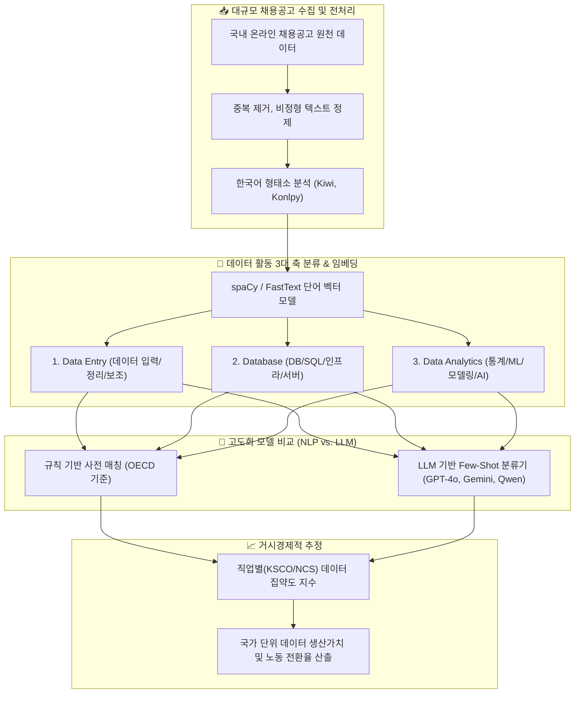

> **📄 후속 연구가 학회에 채택되었습니다**
>
> Giyong Kim, Sojung Kim. *Anchor-and-Verify LLM Cascades for Economic Measurement of
> Data-Intensive Work from Online Job Postings.* IEEE Computational Intelligence in
> Financial Engineering and Economics (CIFEr 2026), Tokyo, 2026년 9월. **채택 — 발표 예정.**
>
> [채택 논문 목록](https://cifer2026.mhirano.jp/accepted_papers)
>
> 아래 글은 이 연구 라인의 초기 작업으로, 사전 기반 추정기와 모델 벤치마크를 다룹니다.
> 논문의 anchor-and-verify 캐스케이드 방법론은 이 글에 포함되어 있지 않습니다.

## 1. 연구 배경: 디지털 경제와 새로운 생산요소 '데이터'

데이터의 생성, 관리 및 분석은 전 산업에 걸쳐 생산성 향상의 핵심 동력으로 자리 잡았습니다. OECD, IMF, BIS 등 주요 국제기구는 국민계정(National Accounts) 체계 내에서 **데이터의 자산 가치를 정량적으로 측정하고, 노동시장에서 데이터 집약적 직무로의 전환 과정을 파악할 것**을 권고하고 있습니다.

본 연구는 두 가지 핵심 축을 중심으로 한국 경제의 데이터 집약도를 실증 분석했습니다:
1. **한국의 데이터 생산가치(Data Production Value) 추정**: 비용 접근법(Cost-based) 및 산출 접근법(Output-based)의 결합
2. **대규모 온라인 채용공고 NLP 분석을 통한 직업별 데이터 집약도(Data-Intensity) 측정**

---

## 2. 전체 분석 파이프라인



---

## 3. 한국어 특화 프레임워크 개발

### OECD 딕셔너리 방식의 한계
기존 OECD 방식은 고정된 영문 키워드 사전 매칭에 의존하여 다음과 같은 한계가 있었습니다:
* **문맥 미반영**: 물류에서의 "분석"과 금융/AI에서의 "분석"을 구분하지 못함
* **신규 직무 탐지 불가**: 'AI 전략 기획', '데이터 거버넌스' 등 융합형 신생 직무 누락
* **한국어 언어적 특성(교착어)**: 어미 변화 및 복합명사에 대한 형태소 분리 실패 시 오분류율 급증

### 한국형 데이터 집약도 추정기 (`DataIntensityEstimatorKR`) 구현
한국어 형태소 분석기(Kiwi)와 벡터 임베딩 모델(spaCy)을 결합하여 의미적 유사도와 분산(Dispersion) 척도를 도입했습니다:

```python
class DataIntensityEstimatorKR:
    def __init__(self, vector_model, global_freq_map):
        self.nlp = vector_model
        self.global_freq_map = global_freq_map

        # 3대 데이터 활동 기준 벡터
        self.categories = {
            "data_entry": self.nlp("데이터 입력 정리 처리 보조 사무 전산 관리 단순").vector.reshape(1, -1),
            "database": self.nlp("데이터베이스 SQL 서버 스토리지 아키텍처 관리 시스템 웨어하우스 DB").vector.reshape(1, -1),
            "data_analytics": self.nlp("데이터 분석 통계 머신러닝 예측 시각화 모델링 알고리즘 AI 인공지능").vector.reshape(1, -1)
        }

    def estimate_job_intensity(self, job_text_tokens):
        # 직무 설명 내 단어와 3대 카테고리 벡터 간 코사인 유사도 및 빈도 기반 집약도 산출
        scores = {}
        for cat_name, cat_vec in self.categories.items():
            sims = [cosine_similarity(self.nlp(tok).vector.reshape(1, -1), cat_vec)[0][0] 
                    for tok in job_text_tokens if tok in self.nlp.vocab]
            scores[cat_name] = np.mean(sorted(sims, reverse=True)[:10]) if sims else 0.0
        return scores
```

---

## 4. 모델별 성능 비교 벤치마크 (NLP vs. LLMs)

사전 기반 NLP 베이스라인과 최신 거대 언어 모델(Zero-shot / Few-shot)의 직무 판별 성능을 체계적으로 비교 검증했습니다:

| 모델 (Model) | 프롬프트 방식 | Accuracy | Precision | Recall | F1-Score | ROC-AUC |
|:---|:---:|:---:|:---:|:---:|:---:|:---:|
| **NLP Baseline** | 규칙/사전 기반 | 0.9138 | 0.4013 | 0.4217 | 0.4112 | 0.6867 |
| **GPT-3.5** | Zero-shot | 0.9106 | 0.3937 | 0.4685 | 0.4279 | 0.7065 |
| **GPT-3.5** | Few-shot | 0.9343 | **0.6359** | 0.1847 | 0.2863 | 0.5883 |
| **GPT-4o** | Zero-shot | 0.9321 | 0.5332 | 0.3869 | 0.4484 | 0.6804 |
| **GPT-4o** | Few-shot | **0.9403** | 0.5953 | **0.5100** | **0.5494** | 0.7417 |
| **Gemini Flash Lite** | Few-shot | 0.7589 | 0.1963 | **0.7684** | 0.3127 | **0.7633** |
| **Gemma-27B** | Few-shot | 0.8878 | 0.3339 | 0.5743 | 0.4222 | 0.7431 |
| **Qwen3-30B** | Few-shot | 0.9359 | 0.6000 | 0.3052 | 0.4046 | 0.6448 |

### 주요 결과
1. **LLM Few-shot의 압도적 우위**: 단순 사전 매칭 대비 `GPT-4o Few-shot` 모델이 F1-Score 기준 $0.4112 \rightarrow 0.5494$로 가장 뛰어난 균형 잡힌 분류 성능을 보였습니다.
2. **산업별 데이터 활동 집중도**: 금융, ICT, 첨단 제조업 순으로 단순 데이터 입력(`data_entry`) 비중은 급감하고 고부가가치 `data_analytics` 및 `database` 집약도가 급증하는 구조적 전환을 확인했습니다.

---

## 5. 결론 및 정책적 함의

* **국민계정 통계의 정밀화**: 데이터 인프라 투자 및 인건비 기반 추정치를 채용공고 기반 직무 집약도로 가중 보정함으로써 국가 데이터 생산가치 추계의 신뢰성을 크게 제고했습니다.
* **디지털 인력 정책 기초자료 제공**: 산업별·직종별로 실제 요구되는 데이터 역량의 수급 불일치(Mismatch)를 정량적으로 식별할 수 있는 모니터링 체계를 구축했습니다.
