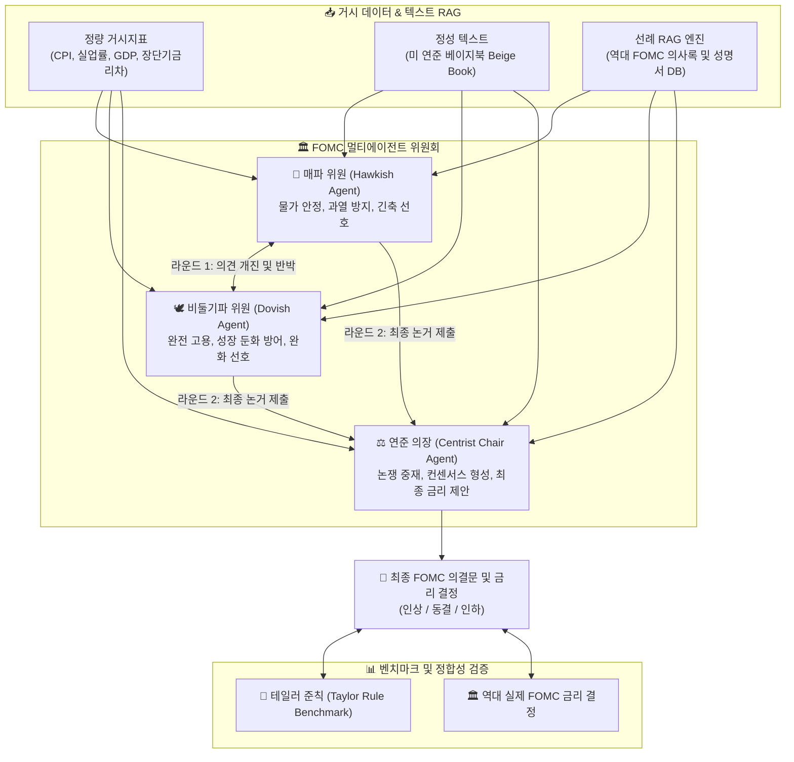

## 1. 문제 정의: 통화정책 위원회의 의사결정 모델링

중앙은행의 기준금리 결정은 단순한 경제학 수식(예: 테일러 준칙)으로만 이루어지지 않습니다. 통화정책위원회(FOMC, 금통위) 내부에서는 **다양한 경제관을 가진 위원들(매파, 비둘기파, 중도파) 간의 치열한 논쟁과 설득, 그리고 타협을 거쳐 최종 정책 합의가 형성**됩니다.

본 프로젝트에서는 **LLM 기반의 멀티에이전트 협의체(Multi-Agent Council)** 를 구성하여, 실제 미국 연방공개시장위원회(FOMC)의 정책금리 결정 과정을 시뮬레이션하고 정량적/정성적 입력 방식에 따른 모델의 예측력을 실증 평가했습니다.

---

## 2. 시스템 아키텍처



---

## 3. 실험 매트릭스 설계 (E1 ~ E6)

시뮬레이션의 정확도를 결정짓는 정보의 형태를 체계적으로 검증하기 위해 **6가지 데이터 구성(E1~E6)** 과 **5가지 모델 아키텍처(M1~M5)** 의 교차 실험을 진행했습니다:

### 데이터 입력 실험 (E1 ~ E6)
* **E1 (Snapshot)**: 당월 기준 거시경제 스냅샷 데이터만 제공
* **E2 (Snapshot + Beige Book)**: 당월 스냅샷 + 연준 베이지북(Beige Book) 정성 분석 텍스트
* **E3 (Trend 3M)**: 최근 3개월간의 거시지표 추세 시계열 데이터
* **E4 (Trend 3M + Beige Book)**: 3개월 추세 + 베이지북 텍스트
* **E5 (Trend 6M)**: 최근 6개월간의 거시지표 추세 시계열 데이터
* **E6 (Trend 6M + Beige Book)**: 6개월 추세 + 베이지북 텍스트

### 모델 아키텍처 (M1 ~ M5)
1. **M1 (Zero-shot)**: 단일 LLM에 지표 제시 후 즉시 결정
2. **M2 (Few-shot)**: 과거 유사 경제 상황의 결정 선례 퓨샷 제공
3. **M3 (RAG Policy)**: 역대 의사록 구조화 검색 기반 생성
4. **M4 (Two-Agent)**: 경제학자 에이전트 + 의장 에이전트 간 1:1 대화
5. **M5 (Full Council)**: 매파 + 비둘기파 + 의장 3자 토론 및 합의 도출

---

## 4. 핵심 발견 및 시뮬레이션 인사이트

```python
# 에이전트 토론 프로토콜 예시
class FOMCCouncil:
    def deliberate(self, economic_context, beige_book, historical_rag):
        hawk_view = self.hawk_agent.analyze(economic_context, focus="inflation_risk")
        dove_view = self.dove_agent.analyze(economic_context, focus="employment_risk")
        
        # 1차 반박 라운드
        hawk_rebuttal = self.hawk_agent.rebut(dove_view, beige_book)
        dove_rebuttal = self.dove_agent.rebut(hawk_view, beige_book)
        
        # 의장 종합 및 최종 의결
        consensus_decision = self.chair_agent.synthesize(
            hawk_rebuttal, dove_rebuttal, historical_rag
        )
        return consensus_decision
```

### 주요 실증 분석 결과
1. **단일 에이전트 대비 과잉 반응(Overshooting) 억제**:
   단일 LLM(M1)은 단기 CPI의 작은 반등에도 즉각적인 50bp 인상을 제안하는 등 극단적 결정을 내리는 경향이 강했습니다. 반면 3자 토론 협의체(M5)에서는 상반된 시각의 견제가 작용하여 실제 연준의 '관망세(Wait-and-See)'와 점진주의(Gradualism) 패턴을 훨씬 정확히 재현했습니다.
2. **베이지북(정성 텍스트)의 선행 정보 효과**:
   정량 지표만 사용한 실험(E3, E5)보다 베이지북의 지역 경제 텍스트가 결합된 실험(E4, E6)에서 경기 변곡점(Inflexion point)에서의 금리 동결/인하 전환 시점을 최대 1~2개 회의 앞서 예측했습니다.

---

## 5. 결론

본 연구는 거시경제 시계열 통계와 정성적 정책 문서를 멀티에이전트 토론 아키텍처로 통합함으로써, 중앙은행의 고도화된 집단 의사결정을 효과적으로 모사할 수 있음을 입증했습니다.
