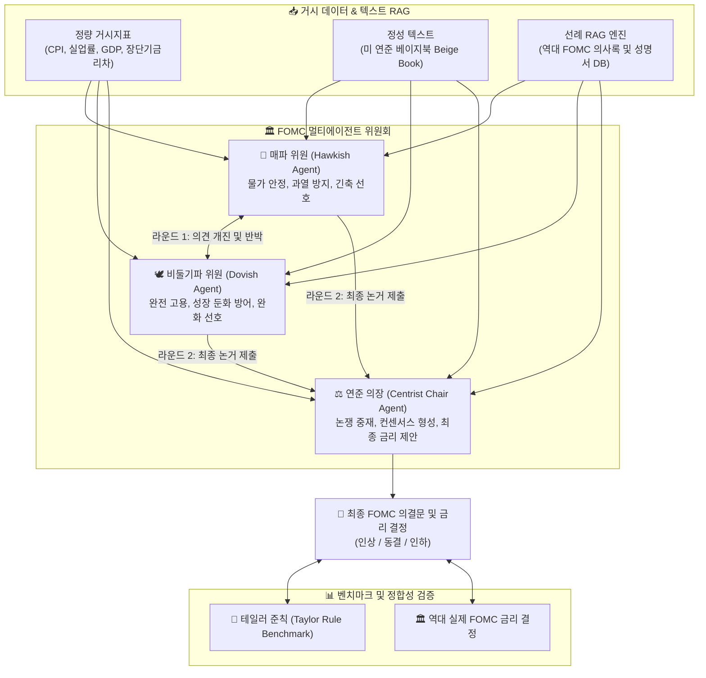

> **📄 이 연구는 논문으로 게재되었습니다**
>
> Giyong Kim, Sojung Kim. *The Conservative AI: Diagnosing Hold Bias and Reliability Limits in
> Persona-Based Monetary Policy Simulation.* Proceedings of the 6th Workshop on Trustworthy NLP
> (TrustNLP 2026), Association for Computational Linguistics, San Diego, July 2026, pp. 663–677.
>
> [ACL Anthology](https://aclanthology.org/2026.trustnlp-main.52/) ·
> [PDF](https://aclanthology.org/2026.trustnlp-main.52.pdf) ·
> [DOI](https://doi.org/10.18653/v1/2026.trustnlp-main.52)

## 1. 문제 정의: 통화정책 위원회의 의사결정 모델링

중앙은행의 기준금리 결정은 단순한 경제학 수식(예: 테일러 준칙)으로만 이루어지지 않습니다. 통화정책위원회(FOMC, 금통위) 내부에서는 **다양한 경제관을 가진 위원들(매파, 비둘기파, 중도파) 간의 치열한 논쟁과 설득, 그리고 타협을 거쳐 최종 정책 합의가 형성**됩니다.

본 프로젝트에서는 **LLM 기반의 멀티에이전트 협의체(Multi-Agent Council)** 를 구성하여, 실제 미국 연방공개시장위원회(FOMC)의 정책금리 결정 과정을 시뮬레이션하고 정량적/정성적 입력 방식에 따른 모델의 예측력을 실증 평가했습니다.

---

## 2. 시스템 아키텍처



---

## 3. 실험 매트릭스 설계 (E1 ~ E6)

시뮬레이션의 정확도를 결정짓는 정보의 형태를 체계적으로 검증하기 위해 **6가지 데이터 구성(E1~E6)** 과 **5가지 모델 아키텍처(M1~M5)** 의 교차 실험을 진행했습니다:

### 데이터 입력 실험 (E1 ~ E6)
* **E1 (Snapshot)**: 당월 기준 거시경제 스냅샷 데이터만 제공
* **E2 (Snapshot + Beige Book)**: 당월 스냅샷 + 연준 베이지북(Beige Book) 정성 분석 텍스트
* **E3 (Trend 3M)**: 최근 3개월간의 거시지표 추세 시계열 데이터
* **E4 (Trend 3M + Beige Book)**: 3개월 추세 + 베이지북 텍스트
* **E5 (Trend 6M)**: 최근 6개월간의 거시지표 추세 시계열 데이터
* **E6 (Trend 6M + Beige Book)**: 6개월 추세 + 베이지북 텍스트

### 모델 아키텍처 (M1 ~ M5)
1. **M1 (Zero-shot)**: 단일 LLM에 지표 제시 후 즉시 결정
2. **M2 (Few-shot)**: 과거 유사 경제 상황의 결정 선례 퓨샷 제공
3. **M3 (RAG Policy)**: 역대 의사록 구조화 검색 기반 생성
4. **M4 (Two-Agent)**: 경제학자 에이전트 + 의장 에이전트 간 1:1 대화
5. **M5 (Full Council)**: 매파 + 비둘기파 + 의장 3자 토론 및 합의 도출

---

## 4. 핵심 발견 및 시뮬레이션 인사이트

```python
# 에이전트 토론 프로토콜 예시
class FOMCCouncil:
    def deliberate(self, economic_context, beige_book, historical_rag):
        hawk_view = self.hawk_agent.analyze(economic_context, focus="inflation_risk")
        dove_view = self.dove_agent.analyze(economic_context, focus="employment_risk")
        
        # 1차 반박 라운드
        hawk_rebuttal = self.hawk_agent.rebut(dove_view, beige_book)
        dove_rebuttal = self.dove_agent.rebut(hawk_view, beige_book)
        
        # 의장 종합 및 최종 의결
        consensus_decision = self.chair_agent.synthesize(
            hawk_rebuttal, dove_rebuttal, historical_rag
        )
        return consensus_decision
```

### 주요 실증 분석 결과

1. **단일 LLM 베이스라인이 이미 강력함**:
   단일 에이전트(M1~M3)만으로도 Hike/Hold/Cut 3분류에서 유의미한 정확도를 확보했고, 큰 흐름의 정책 국면 전환을 추종했습니다. 즉 멀티에이전트 구조를 정당화하려면 이 베이스라인을 **넘어서야** 하는데, 실제로는 그러지 못했습니다.

2. **Hold 편향(Hold Bias)의 발견**:
   평가한 모든 최신 LLM에서 **Hold 판정으로 쏠리는 체계적 행동 비대칭**이 관찰되었습니다. 특히 완화 국면(easing cycle)에서조차 Cut을 예측하기를 꺼렸습니다. 겉보기에는 연준의 '관망세(Wait-and-See)'와 점진주의를 재현한 것처럼 보이지만, 이는 정책 판단을 모사한 결과가 아니라 **모델에 내재한 보수성 편향**입니다.

3. **토론은 편향을 완화하지 못하고 오히려 증폭시킴**:
   매파-비둘기파 토론(M4)이나 합의 도출(M5) 같은 표준적인 에이전틱 워크플로는 Hold 편향을 교정하지 못했습니다. 오히려 상반된 시각의 '견제'가 신중함을 강화하는 방향으로 작동해 편향을 **증폭**시키는 경우가 많았습니다.

4. **국면 전환점에서 비용이 가장 큼**:
   이 보수성은 평시에는 잘 드러나지 않다가, 정확한 적응이 가장 중요한 **정책 국면 전환점에서 가장 큰 오차**를 냅니다.

5. **베이지북(정성 텍스트)의 정보 효과**:
   정량 지표만 사용한 실험(E3, E5)보다 베이지북의 지역 경제 텍스트가 결합된 실험(E4, E6)에서 경기 변곡점 부근의 판단이 개선되는 경향이 있었습니다. 다만 이 효과 역시 Hold 편향 자체를 제거하지는 못했습니다.

---

## 5. 결론

당초 이 프로젝트는 "다양한 경제관을 가진 에이전트들의 토론이 단일 LLM보다 나은 정책 판단을 만들어낼 것"이라는 가설에서 출발했습니다. **실증 결과는 그 가설을 지지하지 않았습니다.**

멀티에이전트 협의체는 사람이 보기에 그럴듯한 심의 과정을 만들어내지만, 그 그럴듯함이 곧 신뢰할 수 있는 의사결정을 뜻하지는 않았습니다. 토론과 합의라는 형식은 구조적 편향을 걸러내는 장치가 아니라, 오히려 편향을 강화하는 증폭기로 작동했습니다.

따라서 정책 결정 지원 시스템에 에이전틱 아키텍처를 적용하려면, **위원회의 표면적 상호작용을 재현하는 것만으로는 부족**하며 구조적 편향을 명시적으로 진단하고 교정하도록 설계된 시스템이 필요합니다. 이 결과는 TrustNLP 2026에 게재되었습니다.
