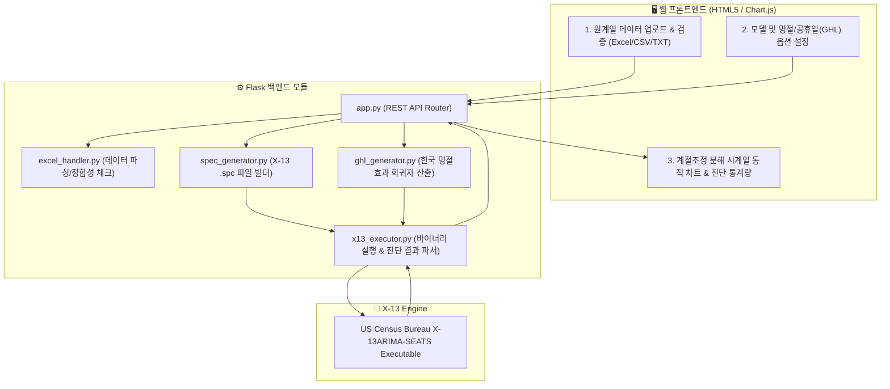

## 1. 배경: 계절변동조정(Seasonal Adjustment)과 BOK-X-13

경제 통계(GDP, 산업생산, 수출입, 소비자물가 등)는 설날, 추석, 여름 휴가철, 연말 등 주기적인 계절 요인에 의해 왜곡됩니다. 정책 입안자와 경제학자들은 기저의 실제 경기 흐름(Trend-Cycle)을 파악하기 위해 미 상무부 센서스국의 **X-13ARIMA-SEATS** 알고리즘을 사용해 계절 요인을 제거합니다.

한국은행은 한국의 고유한 음력 명절 효과(설, 추석) 및 공휴일 패턴을 반영할 수 있도록 개발된 **`BOK-X-13ARIMA-SEATS`** 프로그램을 사용해 왔습니다. 

하지만 기존 프로그램은 **Java / JavaFX 기반의 데스크톱 애플리케이션**으로 작성되어 있어 다음과 같은 한계가 있었습니다:
* 운영체제별 JavaFX 런타임 종속성 및 로컬 설치/업데이트의 번거로움
* 클라이언트 환경에 따른 UI 깨짐 및 그래픽 모듈(`x13graph.jar`) 실행 불안정
* 자동화된 통계 파이프라인(배치 처리, 클라우드 시스템)과의 연동 불가

---

## 2. 웹 마이그레이션 아키텍처

본 프로젝트에서는 복잡한 Java 코드베이스를 **모듈화된 Python Flask 백엔드와 반응형 HTML5/Chart.js 프론트엔드**로 전면 재설계했습니다.



---

## 3. 핵심 모듈별 재설계 (Java $\rightarrow$ Python)

| Java 원본 모듈 | Python 포팅 모듈 | 핵심 역할 및 개선 사항 |
|---|---|---|
| `BOKX13SpecGenerator.java` | `spec_generator.py` | ARIMA 모델 스펙, 로그 변환, 이상치 탐지 옵션을 담은 `.spc` 파일을 프로그래밍 방식으로 유연하게 조립 |
| `BOKX13GhlGenerator.java` | `ghl_generator.py` | 음력 설/추석 전후 기간별 소비/생산 패턴을 반영하는 커스텀 휴일 회귀자(GHL) 파일 자동 생성 |
| `USX13Executer.java` | `x13_executor.py` | X-13 바이너리를 비동기 서브프로세스로 안전하게 실행하고, 메모리 내에서 임시 I/O 격리 |
| `BOKX13OutputAnalHandler.java` | `x13_executor.py` | 텍스트 출력물(`.out`)에서 M1~M11 품질 통계량, Q-통계량, 스펙트럼 진단 결과를 정규식 기반 실시간 파싱 |
| `BOKX13ExcelHandler.java` | `excel_handler.py` | 대용량 다중 시트 엑셀 파일의 시계열 검증, 결측치 보정, 주기(월별/분기별) 자동 감지 |
| `x13graph.jar` (데스크톱 차트) | `Chart.js` (웹 내장 차트) | 원계열, 계절조정계열, 추세순환계열, 불규칙요인을 줌/팬이 가능한 반응형 인터랙티브 차트로 시각화 |

---

## 4. 핵심 코드 구현 상세

### 명절효과 회귀자 및 SPEC 자동 생성

```python
class BOKX13SpecGenerator:
    def __init__(self, series_name, start_period, period_type="monthly"):
        self.series_name = series_name
        self.start = start_period
        self.period = 12 if period_type == "monthly" else 4
        self.options = {}

    def build_spc_content(self, data_file_path, ghl_file_path=None):
        """X-13 표준 spec 문법에 맞추어 동적으로 문자열 생성"""
        spc = f"""series {{
    title = "{self.series_name}"
    start = {self.start}
    period = {self.period}
    data = (
        # Data imported from {data_file_path}
    )
}}
transform {{ function = auto }}
"""
        if ghl_file_path:
            spc += f"""regression {{
    variables = ( td hol )
    user = ( hol )
    file = "{ghl_file_path}"
    format = "datevalue"
}}
"""
        spc += """arima { model = auto }
estimate { }
x11 {
    save = ( d10 d11 d12 d13 )
}
"""
        return spc
```


---

## 5. 도입 성과 및 기대 효과

1. **설치 제로(Zero-Install) 환경 구현**:
   웹 브라우저 접속만으로 복잡한 통계 패키지나 Java 설치 없이 즉시 계절조정 분석을 수행할 수 있게 되었습니다.
2. **배포 및 유지보수 단일화**:
   Docker 컨테이너 기반으로 서버에 단 1회 배포함으로써 클라이언트별 버전 파편화 문제를 완전히 해소했습니다.
3. **통계 자동화 파이프라인 확장성**:
   REST API 엔드포인트(`POST /api/run-x13`)를 제공하여, 정기적인 국가 통계 공표 작업 시 대규모 시계열 데이터를 배치(Batch)로 일괄 계절조정할 수 있는 기반을 마련했습니다.
