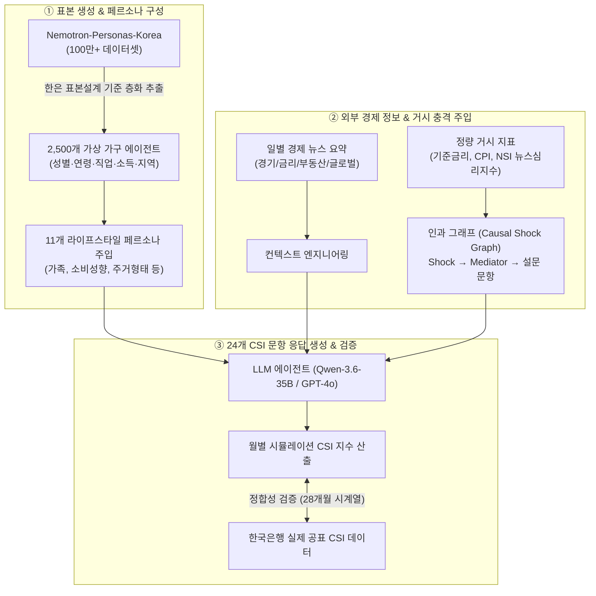

## 1. 연구 배경 및 동기

한국은행은 매월 전국 약 2,500가구를 대상으로 경제 상황에 대한 인식과 향후 전망을 설문 조사하여 **소비자동향지수(CSI, Consumer Sentiment Index)** 를 공표합니다. 이는 통화정책 결정과 경기 판단에 핵심적인 선행 지표입니다.

본 연구는 **"인구통계학적으로 정밀하게 층화된 2,500개의 가상 LLM 에이전트 집단이 실제 인간 응답자 집단의 경제 심리를 얼마나 정밀하게 시뮬레이션할 수 있는가?"** 라는 질문에서 출발했습니다.

---

## 2. 전체 시스템 아키텍처



---

## 3. 단계별 실험 설계 (Stage 1 ~ Stage 4)

에이전트가 현실적인 경제 심리를 형성하는 데 어떤 정보가 결정적인 영향을 미치는지 분석하기 위해 4단계로 정보를 점진적으로 확장했습니다:

| 단계 (Stage) | 입력 정보 구성 | 실험 목적 |
|:---:|---|---|
| **Stage 1** | 인구통계 (Demographics) | 성별, 연령, 직업, 소득, 지역 등 기초 통계만 부여했을 때의 기본 응답 분포 |
| **Stage 2** | + 11종 정성적 페르소나 | 소비 습관, 가족 구성, 주거 상황 등 자연어 페르소나를 통한 이질성(Heterogeneity) 확보 |
| **Stage 2-1** | + 직전 월 응답 기억 (Memory) | 전월 24개 문항 답변을 자기참조(Self-reference)하게 하여 시계열 연속성 및 심리 지속성 모델링 |
| **Stage 3** | + 일별 뉴스 & 정량 거시지표 | 당월의 실제 거시경제 뉴스 요약과 금리/물가/NSI 수치를 주입 |
| **Stage 4** | + 인과 전파 그래프 (Causal Graph) | 거시 충격($z$-score)이 매개체(가계 소득/부채)를 거쳐 개별 문항으로 전파되는 경로 모델링 |

---

## 4. 인과 충격 그래프 (Causal Shock Graph) 메커니즘

단순히 뉴스 텍스트를 프롬프트에 넣는 것만으로는 금리 인상이나 물가 급등이 개별 가계에 미치는 구체적인 파급 경로를 설명하기 어렵습니다. 이를 해결하기 위해 `hsrct_causal_graph.py` 모듈을 설계했습니다.

```python
# 거시 충격의 인과 전파 경로 산출 구조
class CausalShockInjector:
    def __init__(self, shock_data, demographics):
        self.shocks = shock_data
        self.demo = demographics

    def compute_transmitted_impact(self, shock_type, survey_question):
        # Shock z-score 계산 (기준금리, CPI, 주택가격 등)
        z_score = self.shocks.get_zscore(shock_type)
        
        # 가계 특성별 매개 민감도 (예: 저소득 가계의 물가 민감도, 부채 가계의 금리 민감도)
        sensitivity = self.calculate_sensitivity(self.demo, shock_type)
        
        # 해당 설문 문항(q1: 현재생활형편, q7: 가계수입전망 등)으로의 전파 강도
        path_weight = CAUSAL_PATHS[shock_type][survey_question]
        return z_score * sensitivity * path_weight
```

---

## 5. 실증 분석 결과 (2024.01 ~ 2026.04, 28개월)

28개월간 한국은행이 매월 공표한 실제 24개 CSI 문항 및 복합소비자심리지수(CCSI)와 비교 검증한 주요 결과입니다:

```
평가 지표:
• Bias: 평균 편향 (음수 = 과소추정/비관적)
• MAE: 평균 절대 오차
• RMSE: 평균 제곱근 오차
• Corr: 피어슨 상관계수 (트렌드 일치도)
```

### CCSI 종합 성능 (6개 핵심 문항 합성)

| 지표 | BOK 실제 | Stage 1 (인구통계) | Stage 2 (페르소나) | Stage 2-1 (기억) | Stage 3 (뉴스) |
|:---|:---:|:---:|:---:|:---:|:---:|
| **28개월 평균** | **102.61** | 55.06 | 64.57 | 54.29 | 59.77 |
| **Bias** | - | -47.55 | **-38.04** | -48.32 | -42.84 |
| **RMSE** | - | 48.01 | **38.57** | 48.94 | 43.85 |
| **Corr** | - | 0.118 | **0.288** | -0.228 | 0.190 |

### 문항 유형별 Stage간 비교

| 유형 | 최적 Stage | Bias | RMSE | Corr | 핵심 인사이트 |
|:---|:---:|:---:|:---:|:---:|:---|
| **미시적 지표** (q1, q3, q7 등) | **Stage 2** | -23.24 | 23.63 | **+0.398** | 페르소나가 개인 경제 체감을 모사하는 핵심 변수 |
| **거시적 지표** (q4, q5, q10 등) | **Stage 3** | -19.48 | 33.10 | **+0.195** | 뉴스 없이는 시장 흐름 추적 불가 |
| **주택가격전망** (q15) | **Stage 3** | -21.58 | 32.69 | **+0.357** | Corr -0.395 → **+0.357** (0.75pt 전환, 가장 극적 개선) |
| **가계수입전망** (q7) | **Stage 2** | -16.49 | 16.87 | **+0.512** | Stage 전체에서 가장 높은 상관관계 달성 |

### 핵심 발견 사항

1. **LLM의 구조적 부정 편향(Negativity Bias)**: 실제 한국 소비자는 경기가 어려워도 "비슷하다(3)"를 가장 많이 선택하는 현상유지 편향이 있으나, LLM은 "약간 나빠졌다(4)"를 기본값으로 취급하여 전체적으로 과소추정(Bias -38~-48pt) 경향을 보였습니다.

2. **페르소나(Stage 2)의 미시 지표 트렌드 확보**: 페르소나 주입으로 q1(현재생활형편) Bias가 -22.46에서 **-11.03**으로 50% 이상 감소하고, 가계저축전망(q12) Corr이 -0.254에서 **+0.553**으로 극적으로 전환되었습니다.

3. **자기참조 기억(Stage 2-1)의 닻내림 효과(Anchoring Effect)**: 직전 달 응답을 그대로 주입하면 에이전트가 외부 경제 변화보다 "내가 지난 달에 뭐라고 답했지?"에 과도하게 집착하여 **대다수 지표의 Corr이 음수(-0.2 ~ -0.6)**로 추락했습니다. 기억 메커니즘의 개선이 필요합니다.

4. **뉴스(Stage 3)의 거시 트렌드 방향 교정**: 뉴스 요약 주입으로 주택가격전망(q15) Corr이 -0.395에서 **+0.357**로, 임금수준전망(q16)이 -0.193에서 **+0.299**로 전환되었습니다.

---

## 6. 의의 및 향후 응용

* **중앙은행 통화정책 시나리오 분석**: 금리 25bp/50bp 인하 또는 유가 충격 발생 시 가계 심리 변화를 사전에 시뮬레이션(Counterfactual Analysis)할 수 있는 가상 경제 실험실을 구축했습니다.
* **설문 비용 절감 및 실시간성**: 연간 수억 원의 비용과 수주의 시간이 소요되는 대면/전화 표본 조사를 실시간에 준하는 속도로 보조할 수 있는 가능성을 입증했습니다.
* **절대 오차보다 트렌드(Corr) 기반 활용**: 시뮬레이션 CSI가 실제 100 수준을 맞추지 못하더라도, Corr이 양수이면 사후 선형 보정(`Adjusted_CSI = Sim_CSI + Mean_Bias`)으로 절대 오차를 기계적으로 보정할 수 있습니다.

