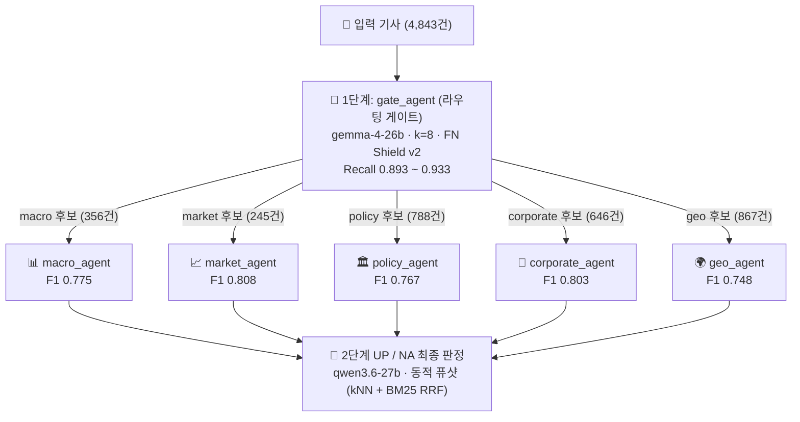

## 1. 개요 (Overview)

경제정책 불확실성(Economic Policy Uncertainty, EPU) 지수는 거시경제 분석과 정책 수립에서 매우 중요한 선행 지표입니다. 하지만 일평균 수천 건에 달하는 방대한 경제 기사에서 실제 정책 불확실성 신호를 고정밀도로 추출하는 것은 극심한 데이터 불균형(Class Imbalance)과 모호성(Ambiguity)으로 인해 단일 LLM 프롬프트만으로는 한계가 있습니다.

본 프로젝트에서는 **한국 경제기사를 5개 차원(Macro, Market, Policy, Corporate, Geo)의 경제정책 불확실성 UP / NA로 판별하는 계층형 2단계 다중 에이전트(Gate + 5 Experts) 파이프라인**을 구축했습니다.

---

## 2. 시스템 아키텍처



### 핵심 설계 철학: 고재현율 게이트와 고정밀도 전문가의 분리
1. **게이트(Gate Agent)**는 **재현율(Recall) 극대화**에 집중합니다. 1단계 게이트에서 탈락한 기사는 하류에서 영구적으로 복구할 수 없으므로, 정밀도를 일부 희생하더라도 후보군을 넓게 통과시킵니다.
2. **5개 전문가(Expert Agents)**는 게이트를 통과한 후보 기사들 중에서 도메인 특화 동적 퓨샷과 맞춤형 휴리스틱을 통해 **정밀도(Precision)와 최종 F1**을 극대화합니다.

---

## 3. 세부 엔지니어링 및 차원별 최적화

### ① 1단계: 라우팅 게이트 (`gate_agent`)
* **모델 및 세팅**: `gemma-4-26b` 기반, $k=8$ 동적 퓨샷 검색
* **FN Shield v2 적용**: 과거 실험에서 False Negative(놓친 불확실성 기사)로 판명된 36건의 하드 케이스를 독립 풀로 관리하여, 유사 기사 유입 시 게이트 통과율을 강제로 보정하는 방어막을 구축했습니다.
* **성능**: 5개 차원 전반에 걸쳐 **Recall 0.893 ~ 0.933**을 달성했습니다.

### ② 동적 퓨샷 검색 (kNN + BM25 Reciprocal Rank Fusion)
2단계 전문가 에이전트들은 정적 퓨샷 대신, 입력 기사와 가장 유사한 예제를 런타임에 동적으로 선별합니다:
* **Dense Vector Search ($k\text{NN}$)**: 기사 제목/본문의 의미적 유사도 계산
* **Sparse Lexical Search ($\text{BM25}$)**: 핵심 경제 용어의 정확한 키워드 매칭
* **RRF 융합**: $RRF\_Score(d) = \sum \frac{1}{60 + rank(d)}$ 공식을 통해 밀집 벡터와 어휘 검색 순위를 종합

```python
# RRF 융합 퓨샷 선별 개념 코드
def get_hybrid_fewshots(query_text, pool, k=20):
    dense_ranks = get_knn_rankings(query_text, pool)
    sparse_ranks = get_bm25_rankings(query_text, pool)
    
    rrf_scores = {}
    for doc_id in pool.keys():
        score = 0.0
        if doc_id in dense_ranks:
            score += 1.0 / (60 + dense_ranks[doc_id])
        if doc_id in sparse_ranks:
            score += 1.0 / (60 + sparse_ranks[doc_id])
        rrf_scores[doc_id] = score
        
    top_k = sorted(rrf_scores.keys(), key=lambda x: rrf_scores[x], reverse=True)[:k]
    return [pool[doc_id] for doc_id in top_k]
```

### ③ 차원별 휴리스틱 파이프라인 커스터마이징

| 차원 (Dimension) | 적용된 핵심 최적화 기법 |
|---|---|
| **Market** | 기사 제목의 어휘 패턴과 본문 문맥에서 연속된 불확실성 패턴을 정밀 검증하여 FP 억제 |
| **Corporate** | 판정 순서를 **NA게이트-first $\rightarrow$ UP신호-first**로 역전. 퓨샷 풀을 2:3(UP:NA)으로 구성하여 과도한 보수적 판정 방지 |
| **Geo** | 제목 외에 본문 상위 600자까지 임베딩. 21종 지정학 키워드 사전 스크리닝으로 **API 호출 비용 27% 절감** 및 문단 신호 코드 재집계(`up_count >= 2`)로 자가일관성 오류 봉쇄 |
| **Policy** | v25 확정 체크리스트 프롬프트 적용 및 $k=40$ 대규모 퓨샷 풀 검색 |
| **Macro** | 런타임 동결 풀(68건) 기반 엄격한 거시지표 영향 평가 |

---

## 4. 최종 벤치마크 결과

실제 검증 데이터셋(4,843건 기사) 대상 2단계 최종 F1 실측치입니다.

| 차원 (Dimension) | 게이트 라우팅 건수 | 최종 F1 Score |
|:---|:---:|:---:|
| **Market** | 245건 | **0.808** |
| **Corporate** | 646건 | **0.803** |
| **Macro** | 356건 | **0.775** |
| **Policy** | 788건 | **0.767** |
| **Geo** | 867건 | **0.748** |

---

## 5. 결론 및 시사점

1. **단일 거대 모델보다 특화된 소형/중형 모델의 계층형 파이프라인이 비용 및 성능 면에서 월등합니다.**
2. **동적 퓨샷 풀의 엄격한 동결(Frozen Pool)**을 통해 실험 간 재현성과 데이터 오염을 완벽히 통제할 수 있었습니다.
3. LLM의 불확실한 생성 결과에만 의존하지 않고, **사전 키워드 스크리닝 및 사후 코드 레벨 검증(Rule-based voting)**을 결합하는 것이 프로덕션 레벨 품질의 핵심입니다.
