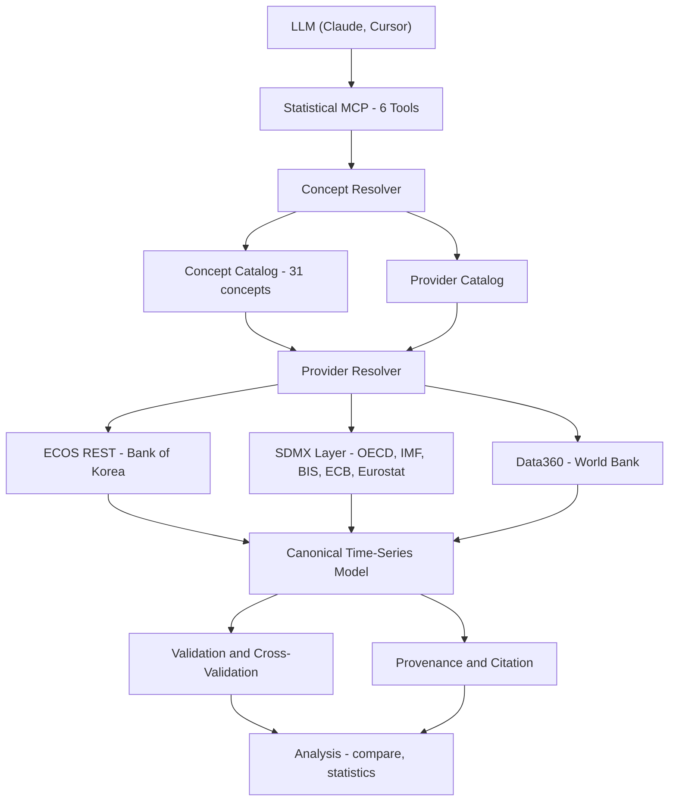

## 1. 개요 (Overview)

LLM에게 "미국·유로존·일본의 기준금리가 어떻게 갈라졌나?"라고 물으면, 모델은 학습 시점의 기억이나 검색된 웹 문서에 기대어 숫자를 만들어 냅니다. 정답이 되는 공식 통계는 이미 존재하지만, 한국은행·OECD·IMF·BIS·ECB·Eurostat·World Bank에 **서로 다른 API, 코드 체계, 단위, 기준연도**로 흩어져 있습니다.

이 프로젝트의 목표는 LLM이 **"어떤 경제의 어떤 개념(기준금리, CPI 상승률, 실질 GDP …)"** 만 말하면, 서버가 알맞은 기관을 골라 데이터를 가져오고, 하나의 시계열 형식으로 맞추고, 다른 기관과 대조해 본 뒤, 출처를 붙여 돌려주는 것입니다.

작업은 두 단계로 진행했습니다.

1. **[ECOS MCP](https://github.com/kgy0617/ecos_mcp)**: 한국은행 경제통계시스템(ECOS) Open API 전용 MCP 서버
2. **[Global Economic Statistical MCP](https://github.com/kgy0617/global-economic-statistical-mcp)**: ECOS를 하나의 공급자로 두고 6개 국제기구·중앙은행으로 확장한 서버

---

## 2. 출발점: ECOS MCP

첫 버전은 한국 통계만 다뤘습니다. 여기서 풀어야 했던 문제는 "데이터를 가져오는 것"보다 **"LLM이 쓰기 좋은 형태로 가져오는 것"**이었습니다.

* **7개 읽기 전용 도구**: 모든 도구에 `readOnlyHint`를 달고, 실패는 MCP 표준 에러(`isError: true`)로 돌려줍니다.
* **1-Shot 인기 지표**: `기준금리`, `성장률`, `물가상승률`, `환율`, `M2` 같은 일상 키워드를 통계표·항목 코드에 미리 매핑해, 코드 검색 없이 한 번의 호출로 조회합니다. `"통화"`처럼 여러 지표에 걸치는 키워드는 후보 목록을 담은 에러를 돌려줍니다.
* **로컬 통계표 인덱스**: 띄어쓰기를 무시하고, 여러 단어를 받고, 관련도 순으로 정렬하며, 분류 트리를 따라 내려갈 수 있습니다.
* **토큰 최적화 포맷**: `compact` 포맷은 계열의 이름·단위를 한 번만 쓰고 값은 `[시점, 값]` 배열로 보냅니다. 소비자물가지수 24개월 단일 계열 기준으로 원본 JSON 6,545자가 605자로 줄었습니다.
* **서버 측 변환**: `transform="yoy"`/`"pop"`으로 증감률 열을 붙이고, `changes_only=True`는 값이 바뀐 시점만 남깁니다. 일별 기준금리 2년치 약 500행이 변경 시점 몇 행으로 줄어듭니다.

한국 통계만으로는 "다른 나라와 비교하면?"이라는 가장 흔한 후속 질문에 답할 수 없었습니다. 그래서 질문의 단위를 **통계표 코드**에서 **경제 개념**으로 옮기는 두 번째 단계로 넘어갔습니다.

---

## 3. 시스템 아키텍처

### 핵심 설계: 개념 우선(Concept-First) 조회

LLM은 기관별 데이터셋 코드를 알 필요가 없습니다. `get_data(indicator="CPI_YOY", country="EA")`처럼 **개념 + 경제**만 넘기면, Concept Resolver가 31개 개념 카탈로그에서 해당 경제를 발행하는 기관들을 우선순위대로 찾습니다. 필요하면 `source="BIS"`처럼 기관을 직접 고를 수도 있습니다.

* **공급자 계층**: 한국은행은 자체 REST API, World Bank는 Data360으로 붙고, OECD·IMF·BIS·ECB·Eurostat은 범용 SDMX 어댑터 하나가 맡습니다. 다섯 기관은 SDMX 버전(2.1/3.0)도 응답 형식(SDMX-JSON 1.0/2.0, SDMX-CSV, SDMX-ML)도 제각각이라, 이 차이를 어댑터 안에서 흡수하고 기관별 동시 요청 수도 따로 제한합니다.
* **정규(Canonical) 모델**: 어느 기관에서 왔든 같은 시계열 형식(시점, 값, 단위, 배수, 기준시점, 계절조정 여부)으로 변환합니다.
* **대체 경로**: OECD는 IP당 요청 수를 제한합니다. 제한에 걸리면 같은 개념을 발행하는 다른 기관으로 넘어갑니다.

도구는 6개로 줄였습니다: `search_statistics`, `get_metadata`, `get_data`, `compare_series`, `calculate_statistics`, `explain_indicator`.

---

## 4. 검증: 기관끼리 정말 같은 숫자를 말하는가

공식 통계라고 해서 기관끼리 항상 일치하지는 않습니다. 이 서버의 핵심은 **불일치를 숨기지 않고 분류해서 보여주는 것**입니다.

### ① 모든 시계열에 붙는 점검

국가, 주기, 단위, 배수(10^n), 기간, 결측, 중복, 수정(revision) 8가지를 매 응답마다 `pass / info / warn / fail`로 표시합니다. 예를 들어 `country` 점검은 키 필터를 무시하고 다른 나라 데이터를 돌려주는 공급자를 잡아냅니다.

### ② 기관 간 교차검증

`cross_validate=True`로 같은 개념을 발행하는 모든 기관에서 데이터를 가져와 시점별로 비교합니다. 비교 전에 다음 규칙으로 값을 맞춥니다.

* **개념별 집계**: 플로우(경상수지, GDP)는 합산, 스톡(외환보유액)은 기말값, 금리·물가·지수는 평균
* **완전한 기간만 비교**: 두 분기는 1년이 아니므로 부분 기간은 비교하지 않음
* **리베이스**: 기준연도가 다른 지수와 연쇄가중 실질 GDP는 공통 기간으로 재기준화

결과는 네 가지 중 하나입니다.

| 상태 | 의미 |
|---|---|
| `MATCH` | 허용 오차 안에서 일치 (금리 0.05%p, 지수 0.1%, 그 외 0.5%) |
| `DIFFER` | 차이가 있지만 **검증 가능한 원인**이 있음 (계절조정 차이, 문서화된 차이) |
| `UNRESOLVED` | 차이가 있고 원인을 모름. **숨기지 않고 보고** |
| `NOT_COMPARED` | 비교할 데이터가 부족함 |

`DIFFER`는 근거가 있을 때만 씁니다. 예를 들어 유로존 기준금리는 BIS와 ECB가 다른데, BIS가 ECB의 운영체계 변경 전까지 주요 재융자금리를, 이후에는 예금금리를 따랐기 때문입니다. BIS − 예금금리는 2024-09-17까지 매일 정확히 0.50, 2024-09-18부터는 동일합니다. 이런 근거 없이 불일치를 `DIFFER`로 바꾸는 일은 하지 않습니다.

### ③ 최신 교차검증 결과 (2026-09-26)

기본 6개 경제(한국, 미국, 일본, 중국, 유로존, 영국), 최근 3년, 두 기관 이상이 발행하는 62개 개념–경제 쌍:

| 결과 | 쌍 수 | 예시 |
|---|---:|---|
| `MATCH` | 43 | 한국 기준금리·국고채·실업률 (ECOS vs BIS/OECD), 6개 경제 실질 GDP (리베이스 후) |
| `DIFFER` | 3 | 한국 실질 GDP 전년비 (ECOS 원계열 vs OECD 계절조정) |
| `UNRESOLVED` | 15 | 영국 CPI 상승률 (IMF vs BIS 최대 0.96%p), 원/달러 일별 환율 (ECOS vs BIS 최대 28원) |
| `NOT_COMPARED` | 1 | KOSPI (sample 키로는 최근 10일만 조회됨) |

62개 중 15개가 아직 원인을 모르는 불일치입니다. 이 숫자를 줄이려고 허용 오차를 넓히는 대신, **LLM이 답변에 "기관 간 차이가 있음"을 그대로 전달할 수 있게** 하는 쪽을 택했습니다.

---

## 5. 출처 추적 (Provenance)

모든 시계열에는 기관, 데이터셋, 시리즈 키, 조회 시각, 쿼리 URL, 적용한 변환, 그리고 바로 붙여 쓸 수 있는 `citation`이 따라옵니다. LLM이 답변에 쓴 숫자가 어디서 왔는지 사람이 다시 확인할 수 있어야 한다는 것이 이 설계의 전제입니다. `output_format="sdmx"`로 SDMX-JSON 메시지 형태로도 받을 수 있습니다.

---

## 6. 테스트와 운영

* **오프라인 테스트**: 모든 기관의 응답을 가짜로 대체한 테스트 145개(테스트 함수 기준)가 Python 3.11–3.13에서 돌아갑니다.
* **매일 실제 API 점검**: 기관들은 데이터플로우와 키를 예고 없이 바꿉니다. 그래서 CI가 매일 6개 경제의 모든 카탈로그 매핑을 실제 API로 다시 확인하고, 교차검증 보고서를 만들어 90일간 보관합니다. OECD가 공용 러너 IP를 제한하기 때문에 이 작업은 실패해도 배포를 막지 않도록 두었습니다.

---

## 7. 한계와 다음 단계

* 교차검증은 기관 간 **차이가 어디에 있는지** 보여줄 뿐, 어느 쪽이 맞는지 판정하지 않습니다.
* World Bank 지표는 연간이고 발표 시차가 있어 최신 연도가 비어 있는 경우가 많습니다.
* 매일 점검하는 것은 기본 6개 경제뿐입니다. 약 40개 경제는 같은 매핑으로 동작하지만 매일 확인하지는 않습니다.
* `UNRESOLVED` 15건의 원인을 하나씩 밝혀 근거와 함께 `DIFFER`로 옮기거나 매핑 오류로 고치는 것이 다음 작업입니다.

---

## 🔗 링크

* **Global Economic Statistical MCP** — [github.com/kgy0617/global-economic-statistical-mcp](https://github.com/kgy0617/global-economic-statistical-mcp)
* **ECOS MCP** — [github.com/kgy0617/ecos_mcp](https://github.com/kgy0617/ecos_mcp)
