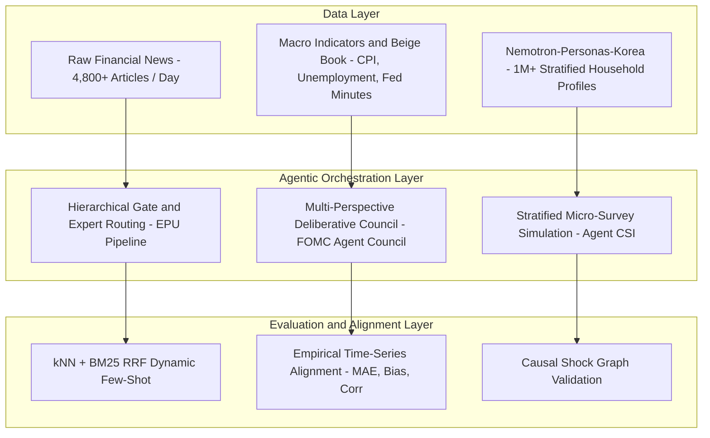

# AI & Multi-Agent Systems Architecture

This section documents the technical principles, system architectures, and engineering methodologies behind our production-grade AI applications and simulation systems in economics and central banking.

---

## 🏛️ System Paradigms

---

## 🔬 Core AI Engineering Methodologies

### 1. Two-Stage Gate Routing with False Negative Shields (EPU Pipeline)
* **High-Recall First Stage**: When classifying rare and critical policy events, early false negatives cannot be recovered downstream. We employ high-capacity lightweight models (`gemma-4-26b` with $k=8$) and custom false negative shielding (`FN Shield v2`) to achieve $0.893 \sim 0.933$ recall.
* **Specialized Expert Second Stage**: Specialized domain agents (`macro`, `market`, `policy`, `corporate`, `geo`) leverage `qwen3.6-27b` with dynamic few-shot retrieval combining dense semantic similarity ($k\text{NN}$) and sparse lexical matching ($\text{BM25}$) via Reciprocal Rank Fusion (RRF).

### 2. Causal Shock Injection & Memory Preservation (Agent CSI)
* **Stratified Agent Populations**: Representing macroeconomic sentiment requires heterogeneous agents. We stratify 2,500 agents along demographic dimensions (age, income, region, occupation).
* **Causal Transmission Pathways**: Macroeconomic shocks are injected via a structural graph ($\text{Shock} \rightarrow \text{Mediator} \rightarrow \text{Survey Item}$), converting real-time economic indicators (CPI z-scores, rate changes, daily news summaries) into contextualized agent responses.
* **Self-Referential Memory**: Preserving past survey responses to maintain temporal continuity and realistic sentiment persistence across time.

### 3. Multi-Agent Deliberation & Precedent RAG (FOMC Agent Council)
* **Deliberative Polarization**: Simulating monetary policy committee dynamics by giving distinct ideological mandates (Hawkish vs. Dovish) anchored by a consensus-seeking Centrist Chair.
* **Hybrid RAG Precedent Engine**: Retrieving historical policy precedents and meeting minutes to anchor qualitative reasoning in institutional memory.
* **Negative Result — Deliberation Is Not Enough**: Evaluated against strictly time-consistent vintage data, committee-style debate did *not* beat a single-LLM baseline. All models exhibited **Hold bias** — over-predicting Hold and resisting Cut through easing cycles — and debate/consensus aggregation amplified that caution instead of correcting it. Published at [TrustNLP 2026](https://aclanthology.org/2026.trustnlp-main.52/).

## 📖 Deep-Dive Articles

* 🚀 [EPU: Hierarchical 2-Stage Multi-Agent Classification Pipeline](/ai/data/2026/08/15/epu-multi-agent-classification-pipeline.html)
* 🧠 [Agent CSI: Simulating Central Bank Consumer Surveys with 2,500 LLM Agents](/ai/economics/2026/08/08/agent-csi-llm-consumer-sentiment-simulation.html)
* 🏛️ [FOMC Agent Council: Multi-Agent Monetary Policy Deliberation](/ai/economics/2026/02/20/fomc-agent-council-monetary-policy-simulation.html) — published at [TrustNLP 2026](https://aclanthology.org/2026.trustnlp-main.52/)
* 📰 [Central Bank News Analysis System Architecture](/ai/data/2025/11/23/news-analysis-system.html)
