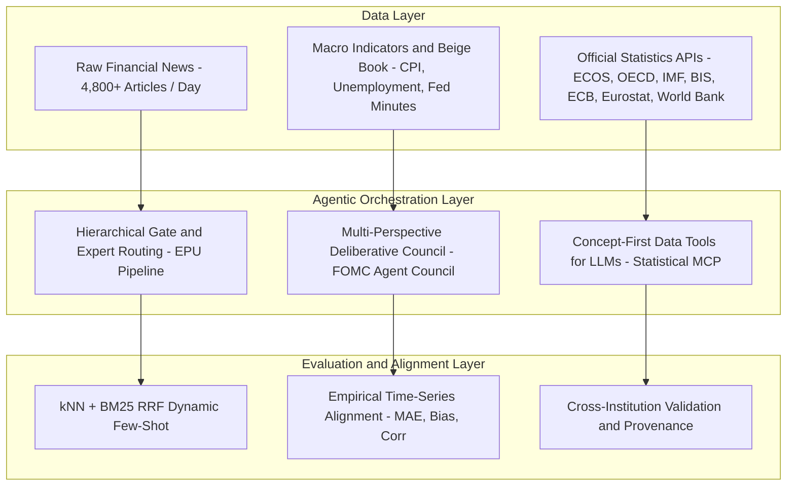

Architecture and methodology notes behind the multi-agent systems I build for economics and central banking — including the parts that did not work.

---

## 🏛️ System Paradigms

```mermaid
graph TD
    subgraph DL["Data Layer"]
        D1["Raw Financial News - 4,800+ Articles / Day"]
        D2["Macro Indicators and Beige Book - CPI, Unemployment, Fed Minutes"]
        D4["Official Statistics APIs - ECOS, OECD, IMF, BIS, ECB, Eurostat, World Bank"]
    end

    subgraph AOL["Agentic Orchestration Layer"]
        A1["Hierarchical Gate and Expert Routing - EPU Pipeline"]
        A2["Multi-Perspective Deliberative Council - FOMC Agent Council"]
        A4["Concept-First Data Tools for LLMs - Statistical MCP"]
    end

    subgraph EAL["Evaluation and Alignment Layer"]
        E1["kNN + BM25 RRF Dynamic Few-Shot"]
        E2["Empirical Time-Series Alignment - MAE, Bias, Corr"]
        E4["Cross-Institution Validation and Provenance"]
    end

    D1 --> A1 --> E1
    D2 --> A2 --> E2
    D4 --> A4 --> E4
```

---

## 🔬 Core AI Engineering Methodologies

### 1. Two-Stage Gate Routing with False Negative Shields (EPU Pipeline)
* **High-Recall First Stage**: When classifying rare and critical policy events, early false negatives cannot be recovered downstream. I use high-capacity lightweight models (`gemma-4-26b` with $k=8$) and custom false negative shielding (`FN Shield v2`) to achieve $0.893 \sim 0.933$ recall.
* **Specialized Expert Second Stage**: Specialized domain agents (`macro`, `market`, `policy`, `corporate`, `geo`) leverage `qwen3.6-27b` with dynamic few-shot retrieval combining dense semantic similarity ($k\text{NN}$) and sparse lexical matching ($\text{BM25}$) via Reciprocal Rank Fusion (RRF).

### 2. Multi-Agent Deliberation & Precedent RAG (FOMC Agent Council)
* **Deliberative Polarization**: Simulating monetary policy committee dynamics by giving distinct ideological mandates (Hawkish vs. Dovish) anchored by a consensus-seeking Centrist Chair.
* **Hybrid RAG Precedent Engine**: Retrieving historical policy precedents and meeting minutes to anchor qualitative reasoning in institutional memory.
* **Negative Result — Deliberation Is Not Enough**: Evaluated against strictly time-consistent vintage data, committee-style debate did *not* beat a single-LLM baseline. All models exhibited **Hold bias** — over-predicting Hold and resisting Cut through easing cycles — and debate/consensus aggregation amplified that caution instead of correcting it. Published at [TrustNLP 2026](https://aclanthology.org/2026.trustnlp-main.52/).

### 3. Concept-First Data Tools & Cross-Institution Validation (Global Economic Statistical MCP)
* **Ask by Concept, Not by Code**: An LLM should not have to know that euro-area inflation lives in a Eurostat dataflow and Korean inflation in a Bank of Korea table. The MCP server takes a concept and an economy (`CPI_YOY`, `EA`), resolves which of 7 institutions publish it, and normalizes every response into one canonical time-series model.
* **Tool Output Designed for Context Windows**: Starting from the Korea-only [ECOS MCP](https://github.com/kgy0617/ecos_mcp), responses write each series' name and unit once and values as `[period, value]` pairs — a 24-month CPI series drops from 6,545 to 605 characters — and growth rates or change points are computed on the server rather than by the model.
* **Disagreement Is Data**: The same concept is fetched from every institution that publishes it and compared period by period. A difference is labelled `DIFFER` only with verifiable evidence; otherwise it stays `UNRESOLVED` and is returned to the LLM. In the latest run 15 of 62 concept–economy pairs are unresolved — reported rather than tuned away, with a citation on every series so the numbers in an answer can be traced back.

## 📖 Deep-Dive Articles

* 🚀 [EPU: Hierarchical 2-Stage Multi-Agent Classification Pipeline](/ai/data/2026/08/15/epu-multi-agent-classification-pipeline.html)
* 🏛️ [FOMC Agent Council: Multi-Agent Monetary Policy Deliberation](/ai/economics/2026/02/20/fomc-agent-council-monetary-policy-simulation.html) — published at [TrustNLP 2026](https://aclanthology.org/2026.trustnlp-main.52/)
* 🔌 [Global Economic Statistical MCP: Official Macro Statistics an LLM Can Cite](/ai/data/2026/09/26/global-economic-statistical-mcp.html)
* 📰 [Central Bank News Analysis System Architecture](/ai/data/2025/11/23/news-analysis-system.html)

Every article, including the econometrics write-ups, is in the [archive](/archive/).
